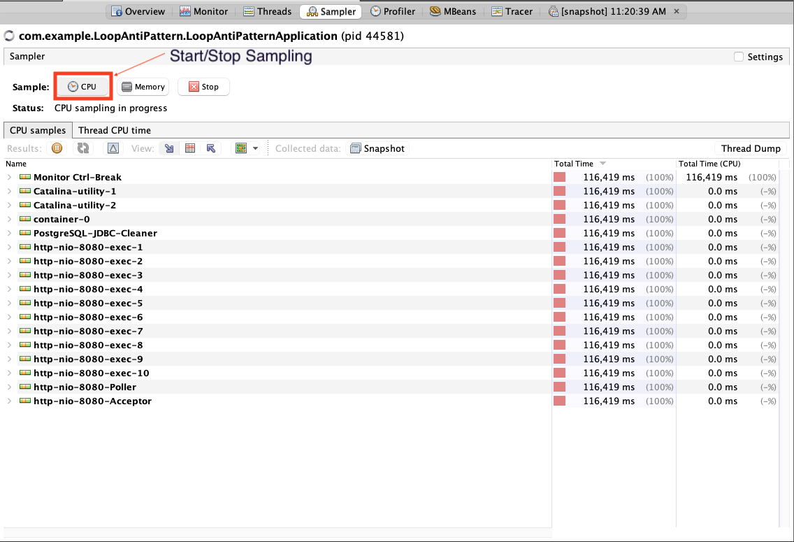
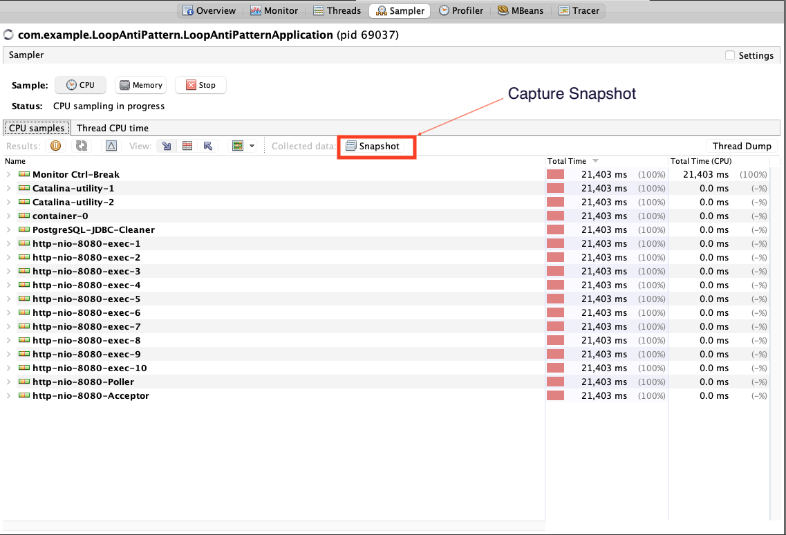
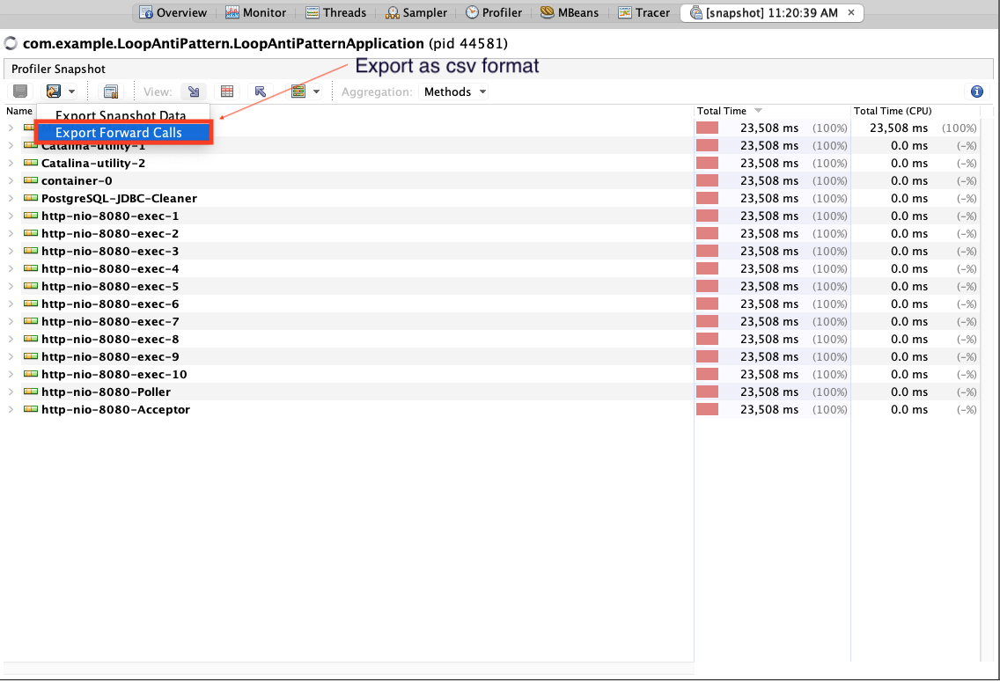

# Sampling Data Generation

To run dynamic analysis and identify potential false positives, it’s essential to gather accurate sampling data from your application. Follow the steps below to generate and export the necessary data as a CSV file, which can then be provided to our tool for analysis.

## Sampling Data Gathering Steps

### 1. Start Sampling

Begin by initiating the sampling process. This step involves monitoring the execution of your application to gather runtime data. The tool will track method calls, execution times, and resource usage during this phase.

### 2. Capture Snapshot

Once you've run your application for a sufficient period to capture relevant data, take a snapshot. This snapshot represents a captured state of your application's runtime, including all the relevant method calls and performance metrics up to that point. The snapshot will serve as the basis for generating the call graph and other analysis metrics.

### 3. Export forward calls as CSV 

After capturing the snapshot, export the collected forward calls data as a CSV file. This CSV will include detailed information about the methods invoked, their execution times, and the sequence of calls, which are crucial for dynamic analysis.

### 4. Save csv and Provide it to our tool

Finally, save the exported CSV file to your local system and provide it to our tool. This file will be used to complement the static analysis results, enabling a comprehensive evaluation of your codebase, identifying potential anti-patterns, and reducing false positives.

Note: If you need further documentation or more detailed instructions, please refer to the [VisualVM documentation](https://visualvm.github.io/documentation.html) for additional guidance.
